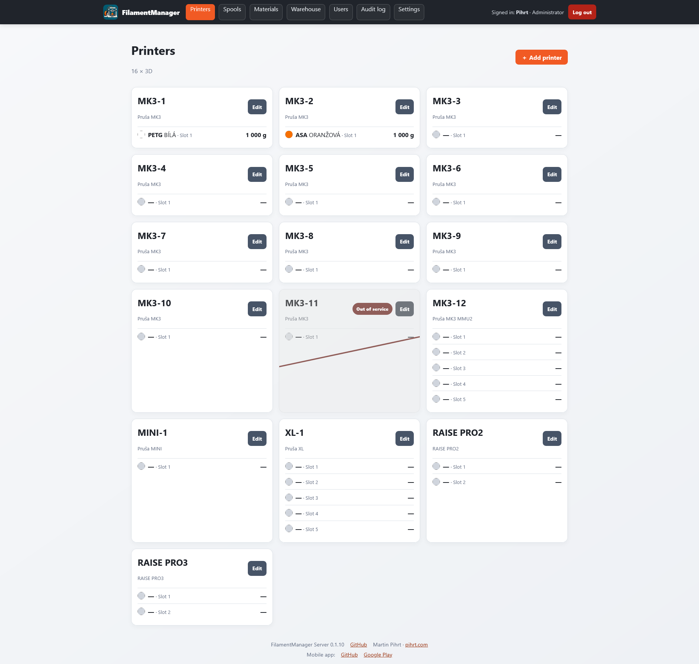
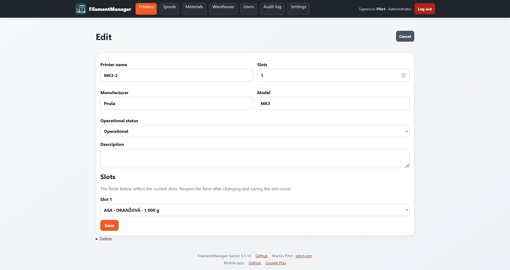
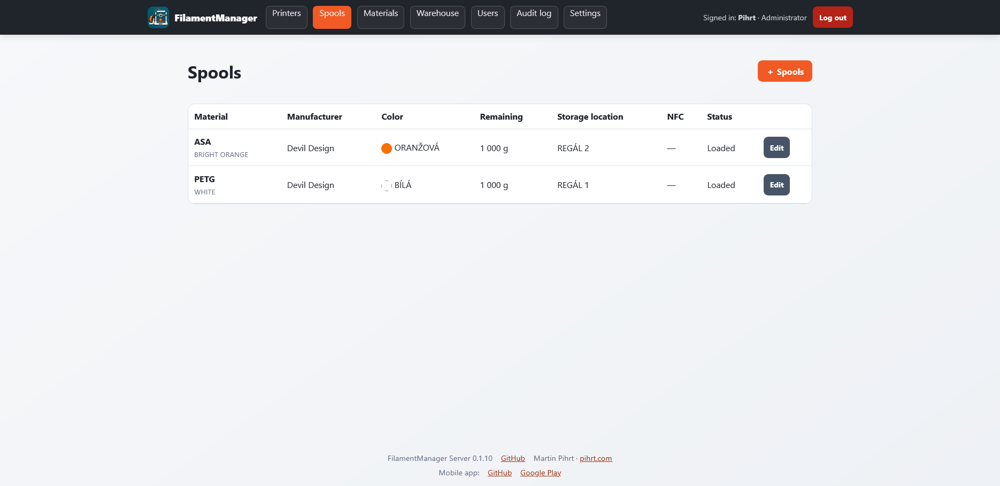
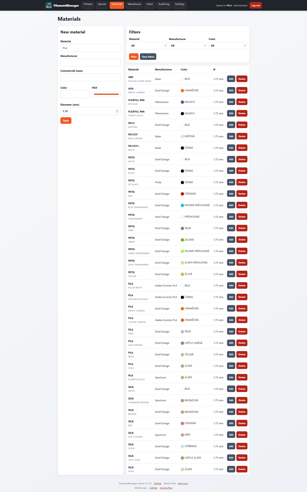
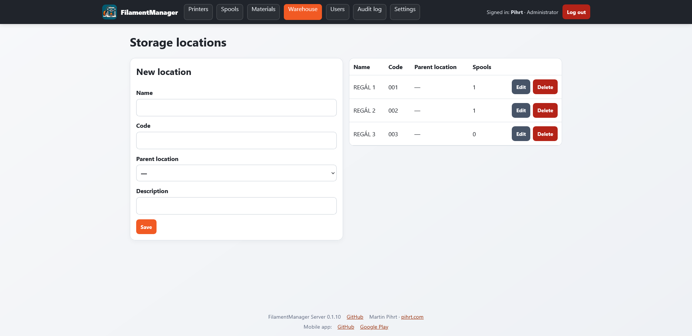
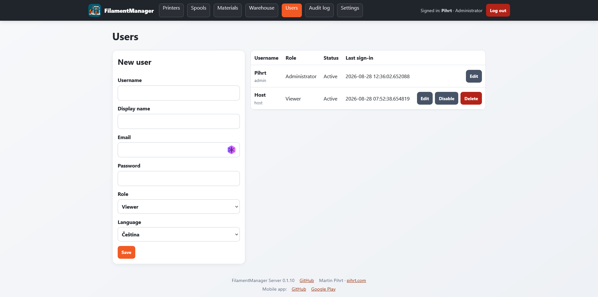
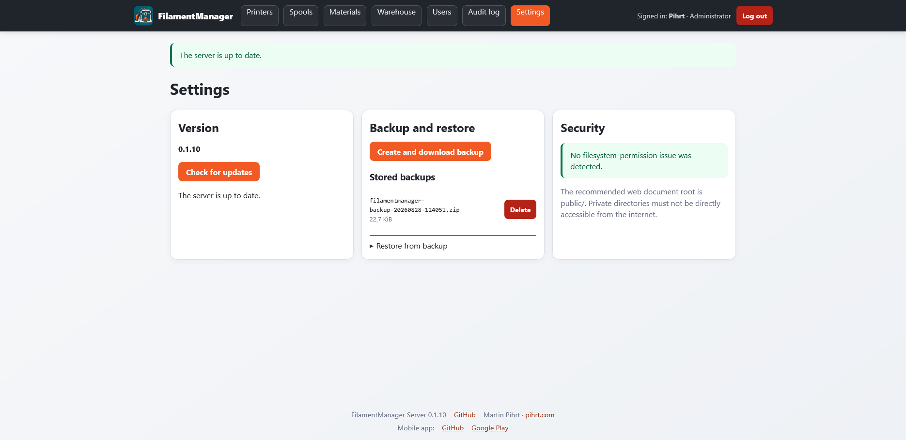

# FilamentManager Server

FilamentManager Server is a self-hosted PHP web application and REST API for managing 3D printers, loaded filament spools, users, and future filament inventory. It is the server companion for [FilamentManager Mobile](https://github.com/pihrt-com/filamentmanager-mobile-app).

The responsive web dashboard mirrors the mobile workflow: each printer shows all filament slots with material, color, and remaining weight. Authorized users can manage printers, spools, materials, manufacturers, locations, and users. Changes are recorded in an audit trail and exposed through the versioned REST API for bidirectional mobile synchronization.

## FilamentManager ecosystem

This repository contains the self-hosted server, web administration, installer, database migrations, backups, updates, and REST API. The companion [FilamentManager Mobile repository](https://github.com/pihrt-com/filamentmanager-mobile-app) contains the offline-first Android client, NFC/OpenPrintTag support, local backups, and USB-testable APK and Google Play builds. Either application can be used independently; connecting them adds secure bidirectional synchronization while the phone remains usable offline.

Start with this server README for hosting, administration, API, backup, and update instructions. Use the [mobile README](https://github.com/pihrt-com/filamentmanager-mobile-app#readme) for Android installation, phone workflows, NFC, local data, and the first-connection choices.

## Features

- Guided browser installation on standard PHP hosting with automatic schema migrations and filesystem checks
- Responsive Czech and English interface for desktop, tablet, and mobile browsers
- Built-in Czech and English Help page explaining the complete inventory workflow to every signed-in role
- Secure web login with administrator, manager, operator, and viewer roles plus CSRF protection and an audit trail
- Printer management with multiple filament slots and operational states
- Natural A–Z, natural Z–A, or administrator-defined custom printer ordering
- Manufacturer, material, spool, and hierarchical storage-location records with OpenPrintTag-ready metadata
- Warehouse inventory grouping and filters plus storage-location details with capacity, free-space, available, loaded, and empty spool visibility
- Print jobs with text G-code usage import, per-extruder physical-spool assignment, actual-usage correction, and deduction only after explicit completion
- Optional PrusaSlicer post-processing helper with restricted, revocable integration tokens
- Per-user email alerts for empty or low-weight spools, unavailable or low-count materials, and full storage locations, backed by encrypted SMTP settings and a retrying queue
- Versioned REST API v1 with device authorization, offline synchronization, idempotent mutations, and conflict detection
- Connected mobile-device overview with one stable record per app installation, immediate administrator-controlled token revocation, and cleanup of revoked devices
- Portable database and application-data backup and restore
- GitHub Release update checks, SHA-256 package verification, automatic pre-update backup, migrations, and application-file rollback

## Screenshots

| Printers | Printer editing |
| --- | --- |
|  |  |

| Spools | Materials |
| --- | --- |
|  |  |

| Storage locations | Users |
| --- | --- |
|  |  |

## Requirements

- PHP 8.4 or newer
- MySQL 8.0+ or MariaDB 10.6+
- HTTPS for production use
- PHP extensions: PDO MySQL, JSON, OpenSSL, mbstring, fileinfo, ZIP

## Installation

Upload a release package to the web server, point the web root to `public/`, and open `/install/`. The installer checks the environment, tests the database connection, creates all tables, creates the first administrator, writes the local configuration, and permanently locks itself.

On shared hosting, set the project directory to `0755` and `.htaccess` plus `prepare-install.php` to `0644`, then open `/prepare-install.php` once. It normalizes all remaining release permissions, verifies writable installer paths, and provides a link to the installer. Delete this preparation script immediately after use.

Two deployment layouts are supported. The recommended layout points the domain or subdirectory document root to `public/`, keeping all private code outside the web root. On Apache shared hosting where this cannot be configured, upload the complete project directory to a subdirectory such as `public_html/filamentmanager` and open `https://pihrt.com/filamentmanager/install/`; the root `.htaccess` blocks all private directories and routes public assets. See [Deployment](docs/DEPLOYMENT.md) for the complete procedure.

The installer requires an existing empty database on most shared hosting services. It validates PHP extensions and writable paths, creates the complete schema, generates a random application key, creates the first administrator, hardens supported filesystem permissions, and writes an installer lock. Delete both installer entry directories after installation when the hosting account permits it; the lock prevents reuse even when deletion is unavailable.

## Administration and updates

Administrators can create and download portable ZIP backups and restore them after a clean installation. A backup contains application data, users, printer assignments, inventory, movements, settings, and audit history. It intentionally excludes MySQL credentials, application secrets, sessions, and mobile device tokens.

The dashboard checks GitHub Releases at a limited interval and notifies administrators when a newer semantic version is available. A one-click update requires the administrator password, creates a database backup, downloads the dedicated release package, verifies its SHA-256 checksum, enables maintenance mode, preserves local configuration and storage, copies the release atomically per file, and applies pending database migrations. See [Updates](docs/UPDATES.md) for the release and recovery procedure.

SMTP is configured in Administration > Settings. Notification types and thresholds are configured for each user. For automatic evaluation and delivery, schedule `php bin/notifications.php` every five minutes. SMTP passwords are encrypted with the installation application key and are intentionally excluded from portable backups; enter the password again after restoring onto a clean installation.

Text `.gcode` files can be imported under Print jobs. Filament usage is not deducted during import: verify the printer, physical spool for every extruder, and actual usage before selecting Complete and deduct. Configure `tools/filamentmanager-prusaslicer.py` as a PrusaSlicer post-processing script to create ready jobs automatically. The helper reads metadata only, never modifies G-code, and does not block export when the server is unavailable. See the complete [PrusaSlicer integration guide](docs/PRUSASLICER.md), including Windows setup, security, and troubleshooting.

## REST API and synchronization

The API is versioned under `/api/v1`. Mobile clients receive short-lived access tokens and a revocable refresh token scoped to the signed-in device. Initial synchronization uses a snapshot; subsequent synchronization uses a monotonic change cursor, client-generated UUIDs, idempotent mutation IDs, optimistic record versions, tombstones, and explicit conflict results. See [API](docs/API.md).

Printer inventory and operational states synchronize in both directions. The web dashboard's A–Z, Z–A, or custom printer order is a server display preference and is intentionally not overwritten by the phone's independent A–Z, Z–A, or drag-and-drop order. The mobile app exposes connection state through its cloud indicator and can trigger synchronization by pulling down on the printer overview.

## Security

Never commit `.env`, backups, logs, API tokens, or production credentials. Production installations must use HTTPS. Web requests use secure sessions and CSRF tokens; mobile clients use short-lived access tokens and revocable device refresh tokens stored in Android secure storage.

## License

Copyright (c) 2026 Martin Pihrt. FilamentManager Server is distributed under the GNU General Public License v3.0, matching FilamentManager Mobile. See [LICENSE](LICENSE).
